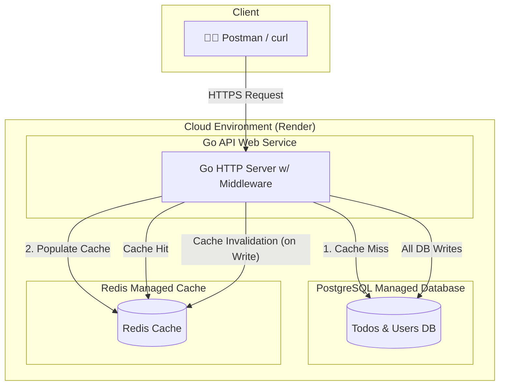

# 📝 Go Todo API  
*A Production-Grade RESTful Service with PostgreSQL, Redis, JWT Authentication, and Cloud Deployment*

[](https://go.dev/)  
[](https://www.postgresql.org/)  
[](https://redis.io/)  
[](https://www.docker.com/)  
[](https://render.com/)

---

## 🚀 Live Demo
The API is deployed on **Render**. You can test it with `curl` or **Postman**.  

🌍 **Base URL**: [https://todo-api-n1s3.onrender.com](https://todo-api-n1s3.onrender.com)  

⚠️ **Note**: This is running on Render’s **free tier**, so the service may **sleep** during inactivity.  
The first request after inactivity may take **15–30 seconds** to respond (cold start).  

---

## 🏛️ Architecture


#Tech Stack

✅ User Authentication with /register & /login

✅ JWT-Protected Routes for all Todo operations

✅ CRUD for Todos (Create, Read, Update, Delete)

✅ Cache-aside Pattern using Redis for fast reads

✅ Cache Invalidation on writes to ensure consistency

✅ Graceful Shutdown to prevent data loss & leaks

✅ Dockerized Setup for local and prod parity

✅ Integration Tests (API + DB + Cache end-to-end)


⚡ Getting Started (Local Development)
🔹 Prerequisites

Docker
 + Docker Compose

make (optional for shortcuts)

🔹 Setup
# 1. Clone the repo
```git clone https://github.com/your-username/go-todo-api.git```
cd go-todo-api

# 2. Copy env file & configure DB/Redis
cp .env.example .env

# 3. Build & start services
docker-compose up --build


API will be live at:
👉 http://localhost:8080

🧪 Running Tests

The test suite spins up a separate Postgres & Redis environment for isolation.

# Start test environment
docker-compose -f docker-compose.test.yml up -d

# Run tests
make test

# Tear down
```docker-compose -f docker-compose.test.yml down```

📖 API Endpoints

Base URL: `https://todo-api-n1s3.onrender.com`

🔹 Authentication
Register
`curl -X POST -H "Content-Type: application/json" \
-d '{"username": "testuser", "password": "password123"}' \
https://todo-api-n1s3.onrender.com/register`

Login
`curl -X POST -H "Content-Type: application/json" \
-d '{"username": "testuser", "password": "password123"}' \
https://todo-api-n1s3.onrender.com/login`


Returns: { "token": "<JWT_TOKEN>" }

🔹 Todos (Protected)

Requires header:
Authorization: Bearer <JWT_TOKEN>

Get All Todos
`curl -H "Authorization: Bearer $TOKEN" \
https://todo-api-n1s3.onrender.com/todos/`

Create Todo
`curl -X POST -H "Content-Type: application/json" \
-H "Authorization: Bearer $TOKEN" \
-d '{"task": "Write README", "completed": false}' \
https://todo-api-n1s3.onrender.com/todos/`

Update Todo
`curl -X PUT -H "Content-Type: application/json" \
-H "Authorization: Bearer $TOKEN" \
-d '{"task": "Updated Task", "completed": true}' \
https://todo-api-n1s3.onrender.com/todos/1`

Delete Todo
`curl -X DELETE -H "Authorization: Bearer $TOKEN" \
https://todo-api-n1s3.onrender.com/todos/1`

📦 Project Structure
go-todo-api/
│── cmd/              # Main entrypoint
│── internal/
│   ├── api/          # HTTP handlers & middleware
│   ├── db/           # Database layer
│   ├── cache/        # Redis cache logic
│   └── auth/         # JWT & password hashing
│── migrations/       # SQL migrations
│── docker-compose.yml
│── Dockerfile
│── .env.example
│── Makefile
│── README.md

🤝 Contributing

Fork the repo 🍴

Create a feature branch (git checkout -b feature-x)

Commit changes (git commit -m 'Add feature x')

Push (git push origin feature-x)

Open a Pull Request 🚀

📜 License

This project is licensed under the MIT License.
Feel free to use, modify, and distribute with attribution.
